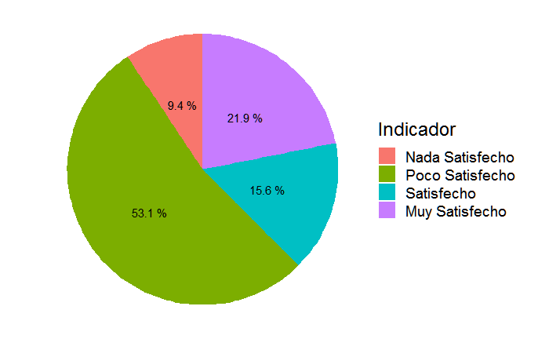

\newpage

# Creando reporte

## Ejempo de texto

**Modo Html**

Este es un  texto en *_itálica_* pero a la vez es <br/>
**negrita** si se agrega otro `*`. Además puedo usar <br/>
ambos a la vez **_itálica en negrita_** <br/>

el `<br>` es para saltos de linea <br/>
en Html <br/>

**Modo Latex pdf**

también puedes usar \newline
otra linea

## Creando Listas

Digamos un párrafo cualquiera

 - lista a
 - lista b
   - lista b1
     - lista b1.1

Otra lista

 a. lista 1
 b. lista 2
   - lista b1
     - lista b1.1
     
¿Le agrada R Markdown?

 - [x] Si
 - [ ] No
 
### citas
 
> Cita en bloque <br>
continua en <br>
otra linea...

> Cita
> en bloque

los otros [^1] también se imprim...

[^1]:son java,php,Ruby,css


## Texto Matemático

Con un $\pmb{\alpha}= 0.05$ se ...

\[
 a^{2} = 2x+y
\]

Aquí otra forma:

$$
 n = \frac{2}{3}
$$


## Escribiendo En Codigos

En una linea va un  `codigo` simple \newline

**Python**

```python
import statistics as stad

tr = [32, 13, 25, 36, 56, 24, 11, 28, 45, 31,23,38]
print(stad.quantiles(tr))
#[23.25, 29.5, 37.5]
```

**html**

```html
 <button type="button">Boton</button>
```

**sql**

```sql
SELECT * FROM TB
```

y muchos otros lenguajes 

## Figuras

agregar libreria

```{r ,echo=FALSE,warning=FALSE, message=FALSE}
library(knitr)
library(ggplot2)
library(plotrix)
```

### Locales

```{r img, echo=TRUE,out.width="45%",fig.cap="grafico",fig.pos="!htbp",fig.align='center'}
					


```

hago referencia a la figura \ref{fig:img}

### Creadas

Fuente de datos ocultos por echo=FALSE

```{r, echo=FALSE}
sp <- c(1,1,1,4,4,4,4,4,4,4,3,3,3,3,3,2,
        2,2,2,2,2,2,2,2,2,2,2,2,2,2,2,2)
indicador <- factor(x = sp ,levels = c(1:4),
             labels = c("Nada Satisfecho",
                        "Poco Satisfecho",
                        "Satisfecho",
                        "Muy Satisfecho"))
tab <- as.data.frame(table(indicador))
```


```{r graf, echo=FALSE,out.width="45%",fig.cap=" Grafico Likert",fig.pos="!htbp",fig.align='center'}

ggplot(tab,aes_(x="",y=tab$Freq,fill=factor(tab$indicador)))+
  geom_bar(width = 1,stat = "identity")+
  coord_polar("y")+
  geom_text(aes(label=paste(round(Freq/sum(Freq)*100,1),"%")),
            position=position_stack(vjust = 0.5))+
  theme_void(base_size = 18)+labs(fill="Indicador")

```

## Tablas

### Creadas Manualmente

Tabla normal sin alinear

|   H1   | H2 | H3  | H4 |
|--------|----|-----|----|
|$\alpha$| 14 | 23  | 23 |
| 2      |    |     | 1  |

Table: Tabla normal

Tabla alineada por columnas

| izquierda |centro|derecha|
|:----------|:----:|------:|
| $\alpha$  | 14   | 23333 |
| **a**     | **b**|**_c_**|

Table: Tabla alineada

## Por libreria

```{r , echo=FALSE}
library(kableExtra)
```

```{r tabla,echo=F}
kable(tab,format="latex",booktabs=T,align="c",
caption="Tabla A")%>%
kable_styling(latex_options ="hold_position")%>%
column_spec(1,bold = T,color = "black")
```

Si quiere ver la referencia (vease **tabla \ref{tab:tabla}** )

## Bibliografias

@khan2020 también incluyo el término...
El autor @khan2020 también ...
El autor [@khan2020] también ...
El autor [@khan2020, pp. 453-454] también ...

\newpage

# Referencias


